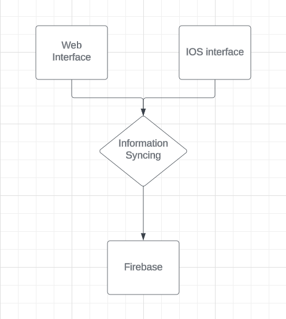
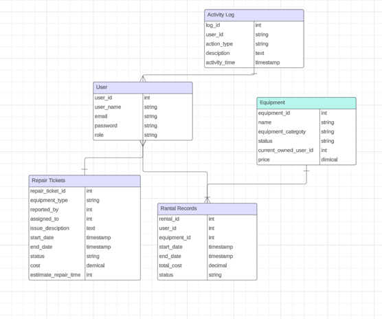

# Requirement Documentation - Gearshare

## Introduction
This document provides audiences with a comprehensive overview of the project aimed at enhancing the data management system for Gear Share.

| **Category**               | **Description**                                                                                  |
|----------------------------|--------------------------------------------------------------------------------------------------|
| **Project Background** | Gear Share, a local equipment rental company that also provides repair services, faces several operational challenges due to its rapid growth. Currently, accessing information between Booqable and Airtable requires users to switch between platforms, leading to inefficiencies in workflow. Additionally, Booqable’s email capabilities are limited to its predefined templates, restricting the ability to send customized and automated communications. Although Zapier automates some processes, many tasks still require manual intervention. As a result, Gear Share is seeking to develop an integrated software solution to streamline workflows, enhance automation, and improve overall service efficiency. |
| **Scope**                | This project focuses solely on enhancing the software layer and will not address any issues related to hardware.  |
| **Objective**                | This project will develop a comprehensive solution to enable the company to manage all its services with additional functionalities.  |
| **System Environments**                | This project will deliver a prototype that operates seamlessly on both web and iOS platforms.  |
| **Stakeholders**                | The client’s team consists entirely of nontechnical professionals, and the development team is composed of members with formal education in computer science.  |
| **Product Perspective**                | The product of this project will be a prototyping software that integrates the current services provided by Airtable and Booqable. It will enable users to manage inventory and track repair records more efficiently with additional functions.   |
|**Constraints**              | This project will deliver a prototype only and will not include any future maintenance or updates. Additionally, the prototype may not fully replace the existing system initially and may require further modifications to achieve complete functionality.   |

## Stakeholders

| **Name**                        | **Role**            | **Email**                          |
|---------------------------------|---------------------|------------------------------------|
| Josh Bossin                     | Gearshare           | josh@mainegearshare.org            |
| Emily Mackeown                  | Gearshare           | emily@mainegearshare.org           |
| Kevin Chen                      | Development Team    | chen.kevin4@northeastern.edu       |
| Comus Hardman                   | Development Team    | hardman.c@northeastern.edu         |
| Vageesh Kudutini Ramesh         | Development Team    | kudutiniramesh.v@northeastern.edu  |
| Yixiao Wu                       | Development Team    | wu.yixia@northeastern.edu          |

## Functional Requirements

| **Function**                      | **Description**                                                                                                    |
|-----------------------------------|--------------------------------------------------------------------------------------------------------------------|
| **Data Management and Integration** | The management system will collect all data from Airtable and Booqable and ensure data synchronization between both platforms. Users will be able to manage inventory, rental records, user information, and repair tickets through the system. |
| **Web App & iOS App**              | The web app and iOS app will provide a consistent experience and functionality with full data synchronization between platforms. |
| **Automatic Processes**            | The management system will automate various customer service processes, including data migration, information synchronization, quoting the services, and report generation. Emails sent to users will be automatically generated using a customized template that can be edited by the user. A chatbot feature will also be added to support customer service interactions. Additionally, customer payments will be managed automatically by the system. |
| **User Management**                | The management system will support various user roles with different levels of authorization. Users will be able to view and edit their personal information based on their assigned permissions. |

## Nonfunctional Requirements

| **Function**               | **Description**                                                                                  |
|----------------------------|--------------------------------------------------------------------------------------------------|
| **User-Friendly Interface** | Given that the client team consists entirely of nontechnical professionals, the product will feature a graphical interface that only requires basic skills such as clicking and typing. |
| **Security**                | Data storage and transmission will be secured through encryption mechanisms. Information access will be controlled based on user roles, with logs generated to monitor user activity. |

## Technology Stack
#### Diagram 1

| **Layer** | **Description**                                                                                                   |
|---------------|-------------------------------------------------------------------------------------------------------------------|
| **Frontend**  | The web interface and iOS app will provide users with access to all functionalities of the management system.      |
| **Middleware**| The information syncing process will collect and integrate data from Airtable and Booqable through their APIs.     |
| **Backend**   | The initial development is designed to use Firebase to store user, inventory, and repair data.                     |

## Data Model

The data model for this project is structured around five primary components: Users, Activity Logs, Repair Tickets, and Rental Records. Data will be interconnected and shared across these components through unique identifiers.

## Acceptance Criteria

| **Feature**                    | **Description**                                                                                                   |
|--------------------------------|-------------------------------------------------------------------------------------------------------------------|
| **User Management**            | Users can register and log in using a username and password. Once users create an account, their user profile will be created. Administrators can manage user accounts by creating, deleting, or editing entries and monitoring user activity. The system will enforce access control based solely on user roles. |
| **Data Integration**           | The system can collect data from both Airtable and Booqable, ensuring seamless information synchronization across platforms. |
| **Equipment Management**       | Users can view the status and pricing of equipment, as well as add or remove equipment entries. Any attribute changes will be reflected in both Airtable and Booqable. |
| **Rental Management**          | Users can view and edit equipment records with certain services being more automated. Any changes to attributes will be automatically synchronized with Airtable and Booqable. |
| **Repair Ticket Management**   | Customers can submit repair tickets, while maintenance staff can view assigned tasks and update their work progress. The system will automatically notify users of status changes and send out quotes through autogenerated emails. |

## API

| **API**               | **Description**                                                                                                       |
|-----------------------|-----------------------------------------------------------------------------------------------------------------------|
| **Airtable API**      | This API can be used to integrate data in Airtable with any external system. [Introduction - Airtable Web API](https://airtable.com/api) |
| **Booqable API**      | This API can be used to view and edit information from Booqable. [Introduction – Booqable API](https://booqable.com/api) |
| **Gmail API**         | This API can be used to automate the process of sending emails. [Gmail API Documentation](https://developers.google.com/gmail/api/guides) |
| **Venmo API**         | This API can be used to automate the payment process through Venmo. [Venmo API Documentation](https://venmo.com/docs/overview/) |
| **Square API**        | This API can be used to automate the payment process through Square. [Square APIs & SDKs](https://squareup.com/us/en/developers) |
| **Firebase API**      | This API can be used to link the webapp & iOS databases. [Firebase API Documentation](https://firebase.google.com/docs/) |

# Release

Windows Port: https://mega.nz/file/5qETyJwA#vvRL0C0S77A4GNLJrDs5IRbnpy7-PCCqNdKWFzk4SEA

MacOS Port: https://mega.nz/file/UvVCDa7Z#g1ACySbnSzif9FhNJMadgEqe7qegQ4fkaa9Vi7M-Am4
